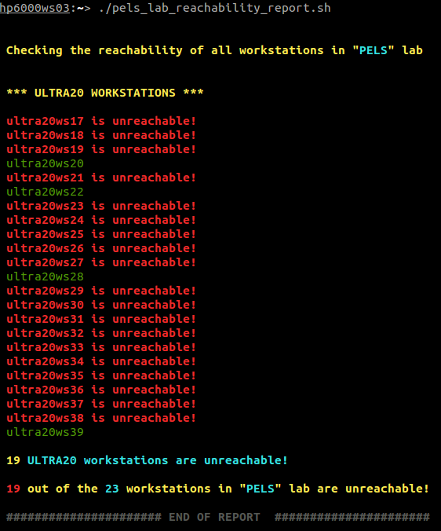
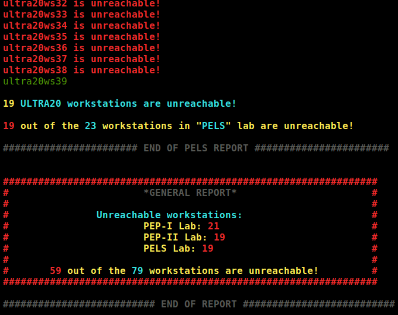

ping-report
============

This repository contains the shell scripts used to ping the laboratory workstations of the [Computer Science and Engineering Department](http://cs.uoi.gr) - [University of Ioannina](http://uoi.gr) and report their status.

Operating System
----
LINUX // Debian-based distributions 
Developed on Debian Linux 6.0.1 (squeeze)

Shell
-----
- Bourne shell (sh)

Screenshot
----------
PELS lab script ouput 

 Example output of the ugrad_lab reachability report script 

Comments
-----
Scripts should be executed on a laboratory workstation and not on Scylla.

